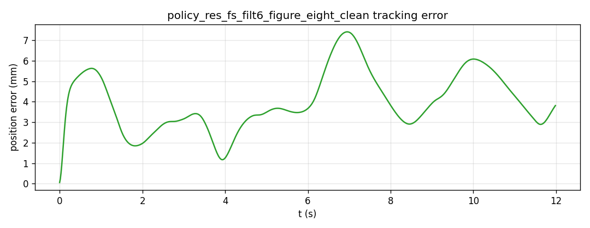
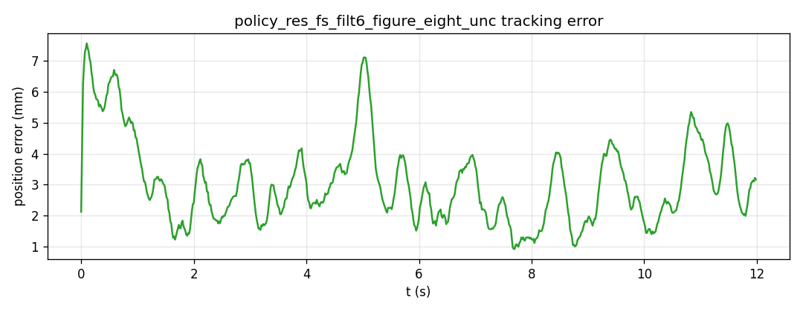
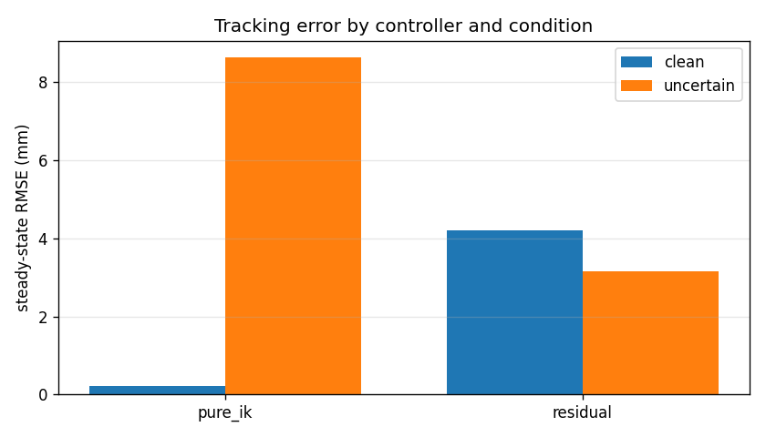
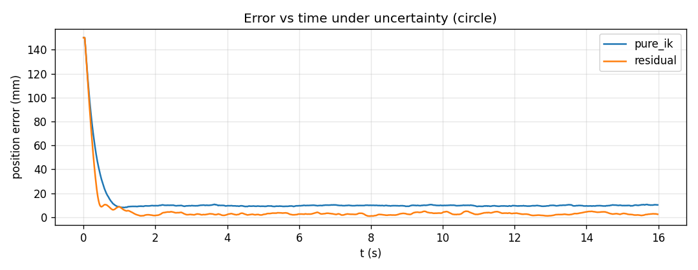
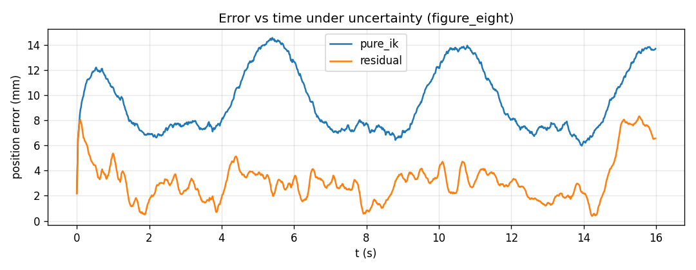
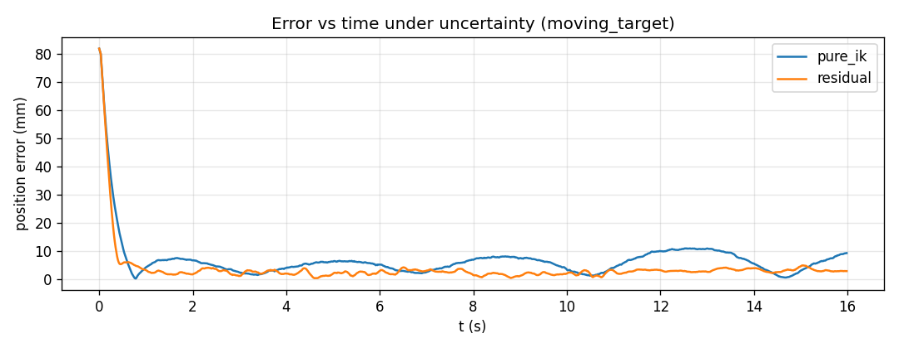

# Residual RL for Robust End-Effector Trajectory Tracking

A 7-DOF Franka Panda (PyBullet) tracks time-varying 3D Cartesian trajectories using
**residual reinforcement learning** layered on top of a **task-priority resolved-rate
inverse-kinematics controller**. The model-based controller does the bulk of the work;
a SAC policy adds a small, bounded correction. The headline result: under realistic
**actuator-gain and control-latency uncertainty**, the residual policy roughly **halves**
the steady-state tracking error of the (already strong) model-based baseline *and* moves
more smoothly — while the controller alone degrades badly.

---

## Headline result

Steady-state tracking error and motion smoothness (EE jerk), averaged over three
trajectory families (circle, figure-eight, moving-target), evaluated on identical
trajectories and seeds:

| Controller | Condition | RMSE (mm) | EE jerk (m/s³) |
|---|---|---|---|
| Task-priority IK (baseline) | clean | **0.21** | **0.4** |
| Residual RL (final) | clean | 4.37 | 2.4 |
| Task-priority IK (baseline) | uncertain | 8.63 | 83.0 |
| **Residual RL (final)** | **uncertain** | **3.34** | **73.8** |

- **Under uncertainty, the residual wins on both axes:** 8.63 → 3.34 mm error (≈61 % lower)
  *and* lower jerk than the baseline.
- **When clean, the baseline is better** (0.21 vs 4.37 mm). This is the honest trade-off —
  see [Limitations](#limitations-and-the-honest-trade-off).

The "uncertain" condition is a fixed actuator gain of 0.70 (30 % velocity undershoot) plus
12 sim-steps of control latency plus sensor/actuation noise — perturbations a reactive
controller cannot fully reject but a learned, anticipatory residual can.

---

## Why residual RL (the core idea)

A pure model-based controller is excellent when its model is right and degrades
systematically when it isn't (an unmodelled actuator gain makes it undershoot; latency
makes it lag). A pure end-to-end RL policy must relearn inverse kinematics from scratch and
has no safety net out of distribution.

**Residual RL keeps the best of both.** The control command is

```
dq = dq_controller(target)  +  residual_scale * policy(observation)
```

- When the model is accurate, the optimal residual is ≈ 0 and behaviour falls back to the
  strong controller.
- When the model is wrong, the policy learns a correction the controller structurally
  cannot produce (e.g. scale commands up to counter gain loss, lead the target to counter
  latency).

Two design choices make this work in practice:

- **Frame-stacked observations (4 frames).** The policy can only compensate for a
  disturbance it can perceive. Stacking recent observations lets it *infer* the condition —
  commanded-vs-achieved velocity reveals the gain, lag patterns reveal the delay — instead
  of applying one blind average correction.
- **Low-pass-filtered residual.** SAC policies tend to output twitchy actions. An
  exponential-moving-average filter on the residual (inside the env, so the policy trains
  with it) removes high-frequency chatter and brings jerk down to near-baseline levels.

---

## Method

**Base controller** (`src/arm_tracking/tasks.py`): recursive task-priority resolved-rate
control with damped-least-squares inversion, hysteresis-gated joint-limit avoidance, and a
null-space posture task. Tracks reachable Cartesian paths to sub-millimetre accuracy.

**RL** (`src/arm_tracking/env.py`, `scripts/train.py`): Soft Actor-Critic (Stable-Baselines3)
in a Gymnasium env.
- *Observation* (46 base dims × 4 stacked): joint angles/velocities, EE-to-target error,
  EE velocity, a short trajectory preview, previous action, and the controller's nominal
  command.
- *Action*: a bounded residual joint-velocity, added to the controller command.
- *Reward*: `w_track·exp(−err/σ) − w_act·‖a‖² − w_smooth·‖a−a_prev‖²`, computed from the
  **true** state (never the noisy observation) to prevent sensor-gaming. A divergence
  penalty equal to the forfeited future reward removes the "suicidal-termination" exploit.

**Uncertainty model** (Phase 4): actuator velocity gain, control-latency buffer, observation
noise, and actuation noise — all applied to the *executed* command so they degrade the base
controller (not just the policy). Domain-randomized per episode during training; fixed for
evaluation.

**Smoothness metrics** (`src/arm_tracking/metrics.py`): RMS EE/joint jerk, command jitter,
and spectral arc length (SPARC), so smoothness is *measured*, not asserted.

See [REPORT.md](REPORT.md) for the full design rationale and the experimental progression.

---

## Repository structure

```
ee-tracking/
├── environment.yml
├── README.md
├── REPORT.md
├── src/arm_tracking/
│   ├── sim.py            # PyBullet Panda wrapper (velocity control, markers, video)
│   ├── trajectories.py   # circle, figure-eight, moving-target generators
│   ├── tasks.py          # task-priority resolved-rate controller + tasks
│   ├── ik_controller.py  # minimal single-objective DLS controller (reference)
│   ├── env.py            # Gymnasium env: residual action, frame stack, uncertainty, reward
│   └── metrics.py        # tracking + smoothness metrics
├── scripts/
│   ├── run_baseline.py   # controller-only tracking (+ GUI/video)
│   ├── train.py          # SAC training (curriculum, uncertainty, frame stack, filtering)
│   ├── watch_policy.py   # roll out a trained policy; save plot/video/CSV
│   ├── compare.py        # pure-IK vs residual vs end-to-end across clean/uncertain
│   ├── test_pose_targets.py
│   └── check_env.py
└── outputs/              # generated plots, videos, tables
```

---

## Setup

```bash
conda env create -f environment.yml
conda activate ee-tracking
# GPU PyTorch matching your CUDA toolkit (example: CUDA 12.x):
pip install torch --index-url https://download.pytorch.org/whl/cu121
pip install stable-baselines3 tensorboard gymnasium imageio imageio-ffmpeg
```

Run everything from the repo root as modules (`python -m scripts.<name>`).

---

## Usage

**Baseline (controller only):**
```bash
python -m scripts.run_baseline --traj figure_eight --controller taskpriority --gui --video
```

**Train the final residual policy (curriculum: local → wide → uncertain).** Each stage
continues from the previous; the final stage adds the hardened uncertainty, frame stacking,
residual filtering, and a strong smoothness penalty:
```bash
# Stage 1 — local, clean
python -m scripts.train --mode residual --episode_seconds 16 --n_envs 8 \
    --frame_stack 4 --sigma_pos 0.008 --w_act 0.02 --w_smooth 0.1 \
    --timesteps 200000 --tag res_fs_local

# Stage 2 — wide workspace (some targets intentionally unreachable)
python -m scripts.train --mode residual --episode_seconds 16 --n_envs 8 \
    --frame_stack 4 --sigma_pos 0.008 --w_act 0.02 --w_smooth 0.1 \
    --wide_workspace --unreachable_frac 0.4 \
    --load models/res_fs_local.zip --timesteps 200000 --tag res_fs_wide

# Stage 3 — hardened uncertainty + residual filter + strong smoothness  (final model)
python -m scripts.train --mode residual --episode_seconds 16 --n_envs 8 \
    --frame_stack 4 --action_smoothing 0.1 \
    --sigma_pos 0.008 --w_act 0.02 --w_smooth 1.5 \
    --wide_workspace --unreachable_frac 0.4 --uncertainty \
    --load models/res_fs_wide.zip --timesteps 400000 --tag res_fs_filt6
```

Monitor with `tensorboard --logdir runs` (watch `rollout/mean_pos_error_mm`).

**Watch / record the final policy** (flags must match training: `--frame_stack 4 --action_smoothing 0.1`):
```bash
python -m scripts.watch_policy --model models/res_fs_filt6.zip --mode residual \
    --frame_stack 4 --action_smoothing 0.1 --traj figure_eight --uncertainty --gui --video --csv
```

**Reproduce the comparison table and figures:**
```bash
python -m scripts.compare --residual models/res_fs_filt6.zip \
    --frame_stack 4 --action_smoothing 0.1 \
    --trajs circle figure_eight moving_target --seeds 3 --outdir outputs/filt6_final
```

---

## Command-line reference

> **Flags marked “must match training” are critical at evaluation time.** `--frame_stack`
> changes the observation size, so a mismatch throws a dimension error; `--action_smoothing`
> and the `--unc_*` levels change the dynamics the policy was trained in, so a mismatch gives
> misleading numbers. For the final model always use `--frame_stack 4 --action_smoothing 0.1`.

### `scripts/train.py`

| Flag | Default | What it does / sensible values | Example |
|---|---|---|---|
| `--mode {residual,end2end}` | `residual` | `residual`: RL correction added on top of the IK controller (recommended). `end2end`: RL outputs the full joint command with no controller — a much harder baseline kept for contrast. | `--mode end2end` |
| `--timesteps INT` | `200000` | Total env steps. ~50k = quick sanity; 200k per clean/wide curriculum stage; 400k for the uncertainty stage (it has the most to learn). | `--timesteps 400000` |
| `--episode_seconds FLOAT` | `12.0` | Episode length in seconds (sets max steps). Use **≥16** so even the slowest trajectory finishes a full loop; shorter and the arm never completes a cycle. | `--episode_seconds 16` |
| `--n_envs INT` | `4` | Parallel headless envs for throughput; 8 is comfortable on one GPU. Ignored when `--watch` (forces 1). | `--n_envs 8` |
| `--seed INT` | `0` | RNG seed. | `--seed 1` |
| `--tag STR` | `None` → `mode[+_unc]` | Output name; controls `models/<tag>*` and `runs/<tag>`. Use a unique tag per run so nothing overwrites. | `--tag res_fs_filt6` |
| `--load PATH` | `None` | Continue from a saved `.zip` (curriculum / fine-tune). Obs dims must match, so you **cannot** load a `frame_stack=1` model into a `frame_stack=4` run. | `--load models/res_fs_wide.zip` |
| `--wide_workspace` | off | Spread trajectories across the workspace (some segments deliberately unreachable). Off = centred near home, all reachable. On for the generalization stage. | `--wide_workspace` |
| `--unreachable_frac FLOAT` | `1.0` | With `--wide_workspace`: fraction of episodes placed aggressively. `1.0` = all wide; **`0.4`** = 40 % wide / 60 % reachable (recommended mix); `0.0` = effectively local. Ignored without `--wide_workspace`. | `--wide_workspace --unreachable_frac 0.4` |
| `--uncertainty` | off | Enable the disturbance model (domain-randomized per episode in training). Off = clean dynamics. | `--uncertainty` |
| `--unc_vel_gain FLOAT` | `0.70` | Actuator gain (executed = gain × commanded). `1.0` = none; `0.85` = mild (15 % undershoot); `0.70` = hard (30 %). In training sampled per-episode in `[gain, 1]`. | `--uncertainty --unc_vel_gain 0.70` |
| `--unc_control_delay INT` | `12` | Control latency in sim substeps (240 Hz). `0` = none; `8` ≈ 33 ms; `12` ≈ 50 ms. Sampled per-episode in `[0, value]`. | `--uncertainty --unc_control_delay 12` |
| `--unc_obs_noise FLOAT` | `0.005` | Std of Gaussian noise on the policy’s observation (robustness only — does **not** touch the controller). | `--uncertainty --unc_obs_noise 0.005` |
| `--unc_act_noise FLOAT` | `0.02` | Std of Gaussian noise on the executed command (stability stressor). | `--uncertainty --unc_act_noise 0.02` |
| `--w_track FLOAT` | `1.0` | Weight on the tracking reward `exp(−err/σ)`. | `--w_track 1.0` |
| `--sigma_pos FLOAT` | `0.02` | Error scale σ (m) in the tracking reward. Smaller = sharper gradient near zero (rewards sub-mm) but flatter far out. Final model used `0.008`. | `--sigma_pos 0.008` |
| `--w_act FLOAT` | `0.01` | Penalty on residual **magnitude**. Higher pushes the residual toward 0 (helps recover baseline when clean). | `--w_act 0.02` |
| `--w_smooth FLOAT` | `0.05` | Penalty on action **rate** (jerk). Higher = smoother, but eventually trades accuracy. Final model used `1.5` (with filtering). | `--w_smooth 1.5` |
| `--frame_stack INT` | `1` | Stack the last N observations for temporal context so the policy can infer the disturbance. `1` = single frame; **`4`** for the uncertainty model. Must match at eval. | `--frame_stack 4` |
| `--action_smoothing FLOAT` | `1.0` | EMA filter on the residual to cut jerk. `1.0` = off; `0.3` = moderate; `0.1` = heavy. Must match at eval. | `--action_smoothing 0.1` |
| `--watch` | off | Train in a single live GUI window (forces 1 env, slow, max-speed playback). Eyeballing only. | `--watch` |
| `--watch_all` | off | A GUI window per parallel env (needs `n_envs>1`; resource-heavy/experimental; keep `n_envs` small). | `--watch_all --n_envs 2` |
| `--watch_first_only` | off | With `--watch_all`, only env 0 gets a window; the rest stay headless (robust, full throughput). | `--watch_all --watch_first_only` |

**Putting it together** — the final-model (uncertainty) curriculum stage:
```bash
python -m scripts.train --mode residual --load models/res_fs_wide.zip \
    --frame_stack 4 --action_smoothing 0.1 \
    --sigma_pos 0.008 --w_act 0.02 --w_smooth 1.5 \
    --wide_workspace --unreachable_frac 0.4 --uncertainty \
    --timesteps 400000 --n_envs 8 --tag res_fs_filt6
```

### `scripts/watch_policy.py`

| Flag | Default | What it does / sensible values | Example |
|---|---|---|---|
| `--model PATH` | *required* | Path to the saved `.zip` policy. | `--model models/res_fs_filt6.zip` |
| `--mode {residual,end2end}` | *required* | Must match how the model was trained. | `--mode residual` |
| `--traj {circle,figure_eight,moving_target}` | `figure_eight` | Trajectory to track. | `--traj circle` |
| `--episodes INT` | `1` | Number of episodes to roll out. | `--episodes 3` |
| `--episode_seconds FLOAT` | `12.0` | Episode length; ≥16 to see a full loop. | `--episode_seconds 16` |
| `--frame_stack INT` | `1` | **Must match training** (else obs-dim error). | `--frame_stack 4` |
| `--action_smoothing FLOAT` | `1.0` | **Must match training.** | `--action_smoothing 0.1` |
| `--uncertainty` | off | Evaluate under the fixed disturbance condition. | `--uncertainty` |
| `--unc_vel_gain / --unc_control_delay / --unc_obs_noise / --unc_act_noise` | `0.70 / 12 / 0.005 / 0.02` | The fixed uncertainty levels (used only with `--uncertainty`); set to match what the model trained under. | `--uncertainty --unc_vel_gain 0.70 --unc_control_delay 12` |
| `--gui` | off | Live PyBullet window (real-time paced). | `--gui` |
| `--video` | off | Save an MP4 (records the GUI window if `--gui`, else a headless render). | `--gui --video` |
| `--csv` | off | Dump per-step `(t, error, EE xyz, joints)` to CSV. | `--csv` |
| `--outdir PATH` | `outputs` | Where files are written. | `--outdir outputs` |
| `--label STR` | `None` → model filename | Output name stem. Files are `policy_<label>_<traj>_<clean\|unc>.*`, so different models/conditions never overwrite. | `--label filt6` |

**Putting it together** — the headline uncertain demo (live window + MP4 + CSV):
```bash
python -m scripts.watch_policy --model models/res_fs_filt6.zip --mode residual \
    --frame_stack 4 --action_smoothing 0.1 --traj figure_eight \
    --uncertainty --gui --video --csv
```

### `scripts/compare.py`

| Flag | Default | What it does / sensible values | Example |
|---|---|---|---|
| `--residual PATH` | `None` | Residual policy to evaluate. If omitted, only `pure_ik` runs (no model needed). | `--residual models/res_fs_filt6.zip` |
| `--end2end PATH` | `None` | Optional end-to-end policy for a three-way comparison. | `--end2end models/end2end.zip` |
| `--trajs LIST` | `circle figure_eight moving_target` | Trajectories to average over. | `--trajs circle figure_eight` |
| `--seeds INT` | `3` | Runs averaged per cell (mainly averages noise realizations under uncertainty; the per-traj path is fixed). | `--seeds 5` |
| `--episode_seconds FLOAT` | `16.0` | Episode length. | `--episode_seconds 16` |
| `--conditions LIST` | `clean uncertain` | Which conditions to evaluate. Omit for both; pass one to restrict. | `--conditions uncertain` |
| `--frame_stack INT` | `1` | **Must match the models.** | `--frame_stack 4` |
| `--action_smoothing FLOAT` | `1.0` | **Must match the models.** | `--action_smoothing 0.1` |
| `--unc_vel_gain / --unc_control_delay / --unc_obs_noise / --unc_act_noise` | `0.70 / 12 / 0.005 / 0.02` | Fixed uncertainty levels for the `uncertain` condition; match training. | `--unc_vel_gain 0.70 --unc_control_delay 12` |
| `--outdir PATH` | `outputs` | Where the table/plots go. Use a per-model subdir (e.g. `outputs/filt6_final`) to avoid overwriting earlier runs — the figure filenames themselves are fixed. | `--outdir outputs/filt6_final` |

**Putting it together** — the final comparison (both conditions, 3 trajectories):
```bash
python -m scripts.compare --residual models/res_fs_filt6.zip \
    --frame_stack 4 --action_smoothing 0.1 \
    --trajs circle figure_eight moving_target --seeds 3 --outdir outputs/filt6_final
```

### `scripts/run_baseline.py` (controller only, no RL)

| Flag | Default | What it does / sensible values | Example |
|---|---|---|---|
| `--traj {circle,figure_eight,moving_target}` | `circle` | Trajectory to track. | `--traj figure_eight` |
| `--controller {dls,taskpriority}` | `taskpriority` | `taskpriority` = the full task-priority controller (the baseline used everywhere); `dls` = the minimal single-objective reference controller. | `--controller dls` |
| `--seconds FLOAT` | `12.0` | Duration. | `--seconds 16` |
| `--omega FLOAT` | `0.6` | Trajectory phase rate (rad/s); higher = faster motion. | `--omega 0.9` |
| `--orientation` | off | Also track EE orientation (where supported). | `--orientation` |
| `--gui` | off | Live window. | `--gui` |
| `--video` | off | Save an MP4. | `--gui --video` |
| `--outdir PATH` | `outputs` | Where files are written. | `--outdir outputs` |

**Putting it together** — the pure-IK baseline demo with a recorded window:
```bash
python -m scripts.run_baseline --traj figure_eight --controller taskpriority \
    --seconds 16 --gui --video
```

---

## Results and figures

### Demonstration videos (final model, `res_fs_filt6`, figure-eight)

| Condition | Video | Error-vs-time |
|---|---|---|
| Clean | [`outputs/policy_res_fs_filt6_figure_eight_clean.mp4`](outputs/policy_res_fs_filt6_figure_eight_clean.mp4) |  |
| Uncertain (RL compensating) | [`outputs/policy_res_fs_filt6_figure_eight_unc.mp4`](outputs/policy_res_fs_filt6_figure_eight_unc.mp4) |  |

Per-step logs for these runs:
`outputs/policy_res_fs_filt6_figure_eight_clean_ep0.csv`,
`outputs/policy_res_fs_filt6_figure_eight_unc_ep0.csv`.

> GitHub doesn't play MP4s via inline image tags — the table links open/download them. To
> show a video inline on the repo page, drag the MP4 into a GitHub Release or an issue and
> paste the resulting `user-images.githubusercontent.com` URL here.

Regenerate these with:
```bash
python -m scripts.watch_policy --model models/res_fs_filt6.zip --mode residual \
    --frame_stack 4 --action_smoothing 0.1 --traj figure_eight --gui --video --csv
python -m scripts.watch_policy --model models/res_fs_filt6.zip --mode residual \
    --frame_stack 4 --action_smoothing 0.1 --traj figure_eight --uncertainty --gui --video --csv
```

### Comparison figures

Generated by `compare.py` (final model, `outputs/filt6_final/`):

| Output | |
|---|---|
| Steady-state RMSE, clean vs uncertain |  |
| Error-vs-time — circle |  |
| Error-vs-time — figure-eight |  |
| Error-vs-time — moving target |  |

Full numbers (every metric, every controller × condition):
[`outputs/filt6_final/compare_table.csv`](outputs/filt6_final/compare_table.csv).

Regenerate with:
```bash
python -m scripts.compare --residual models/res_fs_filt6.zip \
    --frame_stack 4 --action_smoothing 0.1 \
    --trajs circle figure_eight moving_target --seeds 3 --outdir outputs/filt6_final
```

`watch_policy.py` names every run `policy_<model>_<traj>_<clean|unc>.*`, so different
policies and conditions never overwrite each other.

---

## Limitations and the honest trade-off

This is a deliberately honest result, not a "wins everywhere" claim.

- **The residual costs clean-condition precision.** A single, always-on residual policy
  applies a learned correction even when the model is already accurate, perturbing an
  otherwise near-perfect command (4.4 mm vs the controller's 0.2 mm when clean). Frame
  stacking gives the policy the information to back off, but it does not learn to fully
  zero its output. This is the central tension of an always-on residual.
- **Smoothness vs. responsiveness is a frontier, not a free win.** Filtering and a strong
  smoothness penalty bring jerk to near-baseline, but heavier smoothing eventually trades
  away tracking accuracy. The final model sits at a deliberately chosen operating point.
- **Simulation only.** No sim-to-real transfer is claimed; the residual-over-controller
  design plus domain randomization is what *would* help close that gap.

### Future work
- **Gate the residual** on a learned disturbance estimate, so it is suppressed when the
  model is accurate (recovering clean precision) and active only when needed.
- **Recurrent / longer-history policy** for sharper online system identification.
- **Held-out trajectory shapes** (Lissajous, spiral, raster) to quantify true
  generalization beyond the training families.


